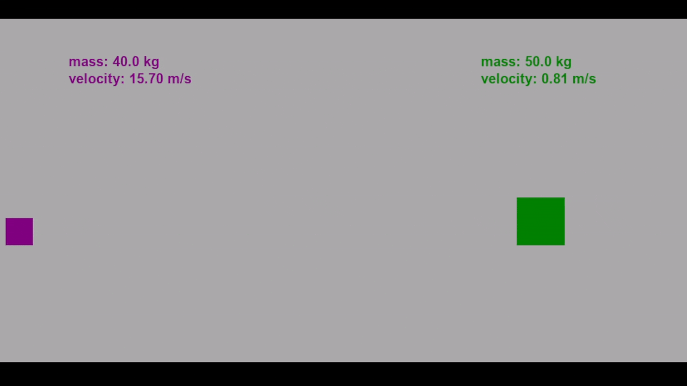
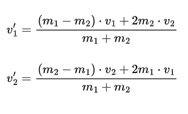

# Elastic-Collision-Simulator

A simple physics-based collision simulator built with Python and Pygame.  
It visualizes elastic collisions between two cubes based on their mass and velocity.




## 💡 Features

- Real-time simulation of 1D collisions  
- User input for mass, velocity, and size  
- Physics calculations based on conservation of momentum  
- Visualization using Pygame  
- Configurable parameters  
- Smooth animation and wall collisions  


## 🧮 Physics

This simulation applies the standard equations for perfectly elastic collisions:




Where:

- \( v_1, v_2 \) – initial velocities  
- \( v_1', v_2' \) – velocities after collision  
- \( m_1, m_2 \) – masses of the objects  

These equations are based on the **law of conservation of momentum** and **kinetic energy**.

### 📁 Project Structure


```
Elastic-Collision-Simulator/
├── main.py             # Main loop
├── config.py           # Screen and simulation settings
├── physics.py          # Collision detection and resolution
├── input_handler.py    # User input and validation
├── ui.py               # Drawing cubes and info text
└── assets/             # Media files for documentation
```
## ▶️ How to Run


### Requirements

- Python 3.10+
- Pygame (`pip install pygame`)

### Installation

```bash
git clone https://github.com/maxkuzz/Elastic-Collision-Simulator.git
cd Elastic-Collision-Simulator
pip install pygame
```

### Running the Simulator
```bash
python main.py
```

### License

---
This project is licensed under the MIT License.
Feel free to use, modify, and share.